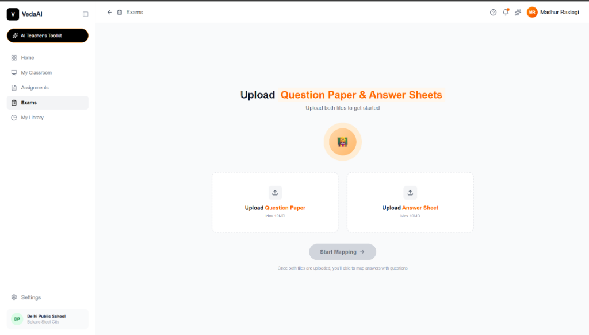
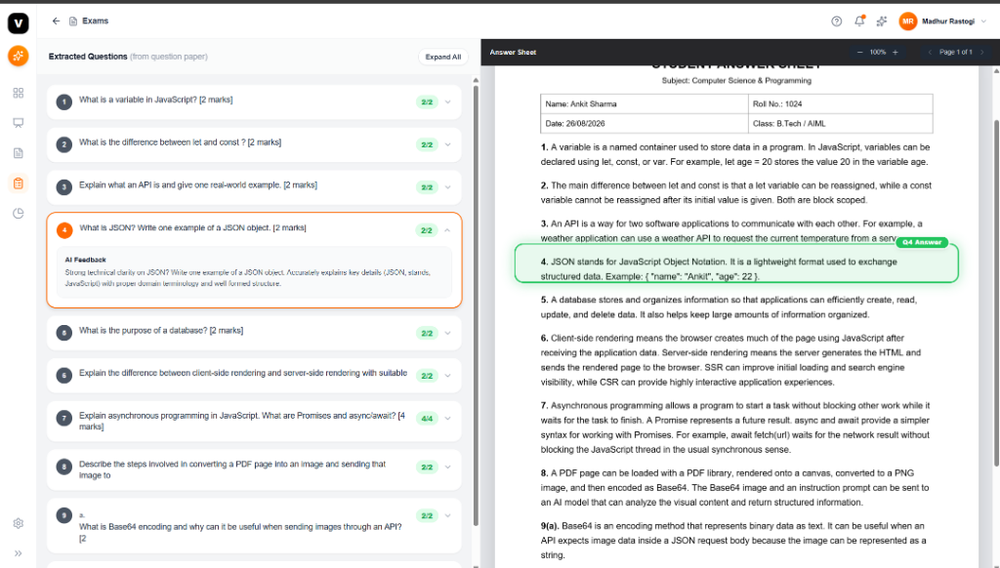

# 🎓 VedaAI - AI Architecture & Engineering Post-Mortem

An intelligent academic assessment platform that uses **Multimodal AI (Google Gemini)**, **PDF.js Vector Matrices**, and **Local OCR Fallbacks** to automate question extraction, student answer mapping, rubric grading, and **pixel-accurate dynamic answer highlighting**.

---

## 📸 Screenshots & UI Showcase

  
<b>1. Question Paper & Student Answer Sheet Upload</b>

  
  
    
  
  
<b>2. Interactive Split-Screen Assessment & Dynamic Highlighting</b>

  

---

## 🤖 1. What AI Does in This Project (AI Roles & Architecture)

### 🧠 A. Multimodal Question Paper Decomposition
- **Role:** Extracts unstructured exam papers containing tables, marks allocations `[2 marks]`, and composite subparts (e.g., `Question 9` $\rightarrow$ `9a` and `9b`).
- **AI Core:** Gemini Vision Multimodal API decomposes questions into discrete JSON-evaluable items.

### 🔍 B. Semantic Answer Sheet Interpretation
- **Role:** Scans handwritten and typed student answer sheets, filtering noise and mapping unstructured written blocks to their respective question numbers.

### 📝 C. Batch Rubric-Grounded Grading & Teacher Feedback
- **Role:** Emulates human evaluator grading. Evaluates student responses against question criteria, clamps marks between `0` and `maxMarks`, and quotes specific domain terminology written by the student to construct unique, constructive teacher feedback.

---

## 💥 2. Real Engineering Problems Faced & Solved

### 🚨 1. Vision Model Bounding Box Drift
- **Problem:** Multimodal LLMs hallucinated vertical percentages across long pages (Q1 was okay, but by Q8-Q9 the green box shifted down by 8%, highlighting the wrong question).
- **Solution:** Replaced LLM visual estimation with **PDF.js `item.transform[5]` vector matrix calculations**, locking highlights mathematically to the actual text glyphs.

### 🚨 2. The "Flattened Text Stream" Trap (Loss of Line Breaks)
- **Problem:** Standard `pdfjs` text extraction joined all tokens with spaces, turning a 50-line exam sheet into **1 single line (`lines.length = 1`)**, breaking regexes and collapsing line-fraction heights to 0.
- **Solution:** Built delta-Y threshold tracking (`Math.abs(itemY - lastY) > 2`) to inject genuine `\n` newlines and embed `[Y:XX.XX]` coordinate tags.

### 🚨 3. The Failure of Hardcoded Heuristics (`startY = 18.2%`)
- **Problem:** Early prototypes used fixed magic numbers for one sample sheet, which broke on sheets with different table headers or no headers.
- **Solution:** Implemented dynamic header-keyword detection (`Roll No`, `Subject`, `Class`) to calculate adaptive start offsets and variable answer heights.

### 🚨 4. Production API Instability (HTTP 429 Rate Limits & 404 Deprecations)
- **Problem:** API quota exhaustion and deprecated preview model tags (`gemini-2.0-flash`) crashed extraction requests.
- **Solution:** Built a **4-tier self-healing fallback engine** (PDF.js Vector Text $\rightarrow$ Gemini Model Rotation $\rightarrow$ Tesseract Node OCR $\rightarrow$ Heuristic Evaluation Engine).

### 🚨 5. Subpart Disambiguation (`9a` vs `9(a)` vs `Question 9.a`)
- **Problem:** Mismatched punctuation between question papers and student sheets prevented answer mapping.
- **Solution:** Standardized canonical key normalization (`normalizeQKey: /[^a-z0-9]/g`).

---

## 📚 Detailed Documentation Files

- 📖 [**AI_AND_CHALLENGES.md**](./AI_AND_CHALLENGES.md) — Comprehensive technical deep-dive into AI roles and engineering hurdles.
- 📖 [**MISTAKES_AND_DEBUGGING_LOG.md**](./MISTAKES_AND_DEBUGGING_LOG.md) — Complete log of bugs, root causes, and solutions.
- 📖 [**DOCS.md**](./DOCS.md) — Full API reference, component architecture, and mathematical coordinate formulas.
